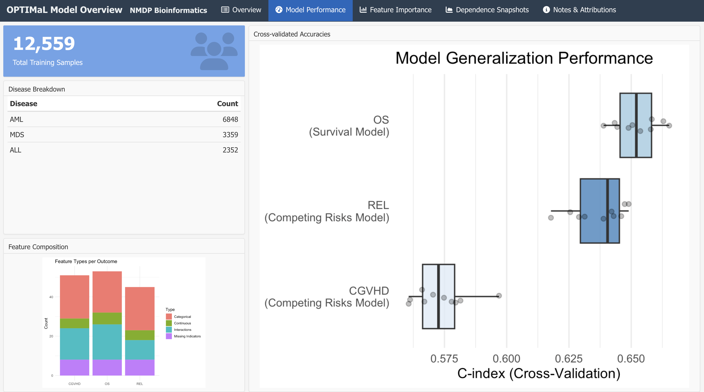

```{r setup, include=FALSE}
knitr::opts_chunk$set(echo = FALSE, warning = FALSE, message = FALSE)
```
<style type="text/css">
.reveal {
  font-size: 24px;
}
.reveal h2 {
  font-size: 1.4em;
  margin-bottom: 0.5em;
}
.reveal ul {
  font-size: 0.85em;
}
.reveal li {
  margin-bottom: 0.3em;
}
.reveal code {
  font-size: 0.75em;
}
.reveal p {
  margin-top: 0.5em;
  margin-bottom: 0.5em;
}
</style>

## Data readiness (PAN-PTCy v2 + HLA-SAVE)

* **Build:** PAN-PTCy v2 enriched with **HLA-SAVE** (HLA columns largely from HLA-SAVE)
* **Cohort used for modeling:** **Bone marrow + peripheral blood only** (cord blood excluded)
* **Outcomes (current):** OS, relapse, **acute GVHD** (grade **2–4**, **3–4**;), cGVHD
* **Additional outcomes:** **NRM**, **GRFS (GVHD/relapse-free survival)**, **TRM**
* **Wishlist & status:** request sent **Dec 1, 2025** — DPB1 permissiveness (v2.0/2.1/3.0), B-leader, additional center/clinical + disease-specific variables. 

## Prediction experiments (PAN-PTCy v2 + HLA-SAVE)

**Cross-validated C-index (avg)**

* **Cox:** OS **0.634**, REL **0.616**, acute GVHD **0.612**, cGVHD **0.574**
* **RSF:** OS **0.648**, REL **0.632**, acute GVHD **0.628**, cGVHD **0.570**


## Deployed OPTIMaL snapshot (same cohort; feature-selected)

```{r, out.width="80%", fig.align="center"}

```


## BART (ml4time2event): questions about BART hyperparameters

**Package:** CRAN BART v2.9.9

**Current defaults:**

* **Survival:** `surv.bart(K=10, ntree=50, ndpost=200, nskip=50, keepevery=2)`
* **Competing risks:** `crisk.bart(K=10, ntree=100, ndpost=1000, nskip=100, keepevery=10, numcut=2)`

**Questions:**

* **Stability:** Why does `crisk.bart()` occasionally fail (retry ≤4×)? How to scale hyperparameters for clinical data (n=100–10K, p=10–100, moderate censoring)?


## PTCy Data Pipeline: Key Facts

<div style="display: flex; gap: 2em;">
<div style="flex: 1;">

**Input Data:**

* **PTCY Main:** 13,304 transplants × 107 variables
* **HLASAVE:** 288,937 records × 219 variables

**Final Output:** `04_standardized_outcomes_deidentified.csv`

* **12,559 transplants** (94.4% retention rate)
* **188 variables** (deidentified)

**Exclusions:**

* Cord blood: 687 transplants (5.2%)
* Duplicates/flags: 58 transplants (0.4%)
* **Total excluded: 745** (5.6%)

</div>
<div style="flex: 1;">

**Graft Types (Final):**

* Peripheral blood: 11,140 (88.7%)
* Bone marrow: 1,419 (11.3%)

**Variables:**

* Started: 309 standardized variables
* Removed: 121 sensitive variables (identifiers, dates, detailed HLA types)
* Final: 188 analysis variables

</div>
</div>

